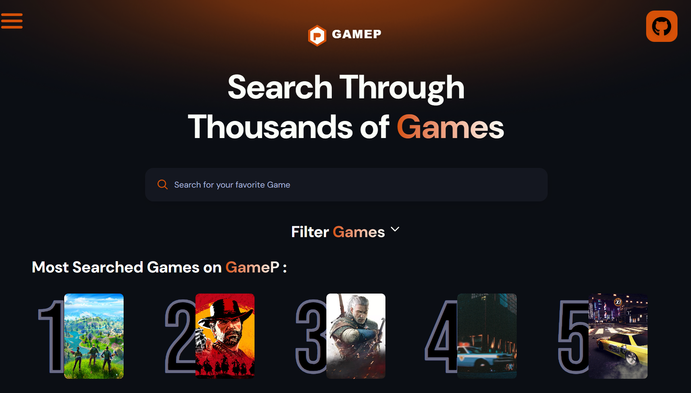

# 🎮 GameP

  

GameP is a modern web app for discovering video games with detailed information and fast search.  
Built to showcase clean React architecture, API integration, and UI/UX design.

## ✨ Features
- Fast game search
- Detailed game information
- High performance with Vite
- Clean, responsive UI

## 🛠️ Tech Stack
- React
- Vite
- JavaScript (ES6+)
- Tailwind CSS
- RAWG Game API

## 🎯 Purpose
A portfolio project demonstrating real-world React development and API usage.

### 🚀 Quick Start
1. Clone the repo: `git clone https://github.com/IbrahimAl-Bari/GameP.git`
2. Install dependencies: `npm install`
3. Run the app: `npm run dev`
4. Open `http://localhost:5173` in your browser

### 🌐 Live Demo
[View Live App](game-p-rho.vercel.app)

## 👤 Author
Ibrahim Al-Bari  
GitHub: @IbrahimAl-Bari
